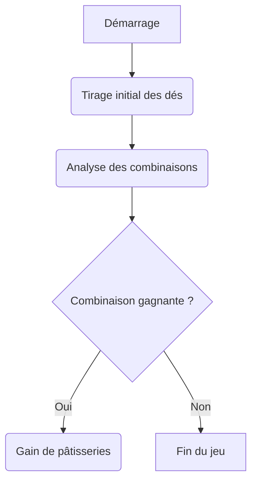
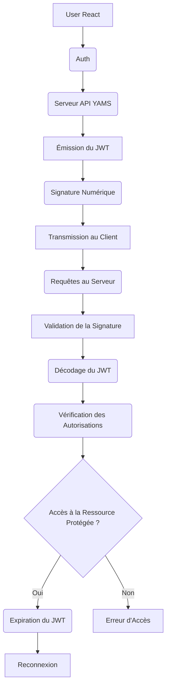

# Sujet App Yams

## Contraintes techniques

# 🎲 Sujet App Yams

Pour le rendu vous devez rendre une application fonctionnelle, le code source sera mis sur un Git (github). Vous devez également présenter votre organisation de travail ainsi qu'un README.md préparant votre soutenance et ses étapes.

🎱 Rappels des étapes de la soutenace.

*La soutenance dure 20 minutes.*

1. Présentation des membres de l'équipe
2. Présentation du projet
3. Présentation des techniques utilisées ainsi que la persistance données ( dans un fichier unique pas de modèle).
4. Présentation d'une partie choisie de code
5. Démonstration
6. Questions du jury

Vous devez réaliser une application en équipe, composée de 2 personnes au maximum, en React, en utilisant l'API Yams.

Vous devez créer un dépôt afin que votre formateur puisse suivre le développement de cette application tout au long de la semaine.

L'utilisation de RTK Query, d'un système de routing et la création de pages responsive sont obligatoires. Vous devez intégrer l'API Yams et vous référer à la documentation fournie dans ce document.

Votre mission consiste à développer un jeu pour une pâtisserie. Vous devez implémenter un jeu de Yams avec des combinaisons gagnantes. Trois combinaisons permettent de gagner des pâtisseries :

1. 🎲 Yams : vous gagnez trois pâtisseries choisies au hasard.
2. 🎲 La grande suite : deux pâtisseries choisies au hasard.
3. 🎲 Le carré : une pâtisserie.

L'utilisateur de l'application peut relancer les dés jusqu'à 3 fois maximum.

Dans ce projet, vous devez également développer un CRUD sécurisé des pâtisseries. Vous devez donc créer une page de connexion et un tableau de bord pour administrer les pâtisseries.

Vous avez carte blanche en ce qui concerne le choix graphique. Veillez à concevoir une application fluide, respectant au maximum les principes d'UX/UI.

## 🖌️ Construire les wireframes
Imaginez l'application avant de la développer, créez les wireframes de l'application.

## Trello ou Notion.so
Écrivez les étapes de développement dans un ordre précis puis répartissez ces fonctionnalités dans Trello ou Notion.so.

## Diagramme

Diagramme de flux de processus pour un lancé.



## Contraintes techniques API

🔗 [api](https://github.com/Antoine07/yams-project/)

Certains points dans cette documentation vous sont détaillés à titre d'information, vous n'avez pas à les développer.

1. ⓘ Utilisez l'API Yams développée en Express par nos soins. Voir le fichier **install_api**, récupérez l'API et consultez ses documentations :
    1. API pour le jeu non sécurisé  [api game](./documentation_game_api.md).
    1. CRUD API **sécurisé** [api crud](./documentation_crud_api.md).
    1. user **sécurisé** pour la route logout uniquement [user](./documentation_authentification.md).
    1. me **sécurisé ou pas** tester si l'utilisateur est toujours connecté [me](./documentation_me_api.md).

2. ⓘ Les données de l'API (pâtisseries) persistent dans un fichier **pastries.json**. Les données des utilisateurs sont stockées sur le serveur et ne sont pas modifiées.

3. ⓘ Vous n'avez pas à vous soucier du code source de l'API. Utilisez sa documentation pour développer le projet.

4. ⓘ Attention aux règles **CORS**. Dans les fichiers .env de l'API et .env.development, des adresses spécifiques pour chaque application sont définies. Dans l'API, nous précisons l'adresse de la source dans les variables d'environnement. Cela est nécessaire pour éviter le blocage des requêtes de votre application REACT sur l'API par votre navigateur.

5. 🛡️ L'API est basée sur JWT. Voici le schéma du processus JWT :



## ⚠️ Cors 

🚀 CORS (Cross-Origin Resource Sharing) est une politique de sécurité implémentée par les navigateurs web pour restreindre les requêtes HTTP/HTTPS entre différents domaines. 

En d'autres termes, CORS définit comment un navigateur web permet à une application web d'accéder aux ressources situées sur un autre domaine que celui à partir duquel elle a été chargée.

Lorsqu'un navigateur effectue une requête HTTP/HTTPS vers un domaine différent de celui de la page web actuelle, il envoie une requête CORS préalable (préflight request) pour déterminer si le serveur autorise la requête. Le serveur peut alors renvoyer des en-têtes CORS spécifiant les origines autorisées, les méthodes HTTP autorisées, les en-têtes autorisés, etc.

CORS est essentiel pour sécuriser les applications web en empêchant les attaques par injection de scripts malveillants à travers les requêtes cross-origin.


```js
import cors from "cors";

app.use(cors({
  // url APP REACT
  origin: `http://${APP_REACT_URL}:${APP_REACT_PORT}`,
  credentials: true
}));
```

1. 🚧 Installez un projet React, suivez les indications ci-après, pour mettre en place le projet.


## Présentation du projet

Le propriétaire, **doit se connecter**, de l'application, il fait un CRUD sécurisé sur les pâtisseries.

Le joueur **ne se connecte pas** pour jouer, il joue au Yams pour gagner une pâtisserie.

**Règle du jeu** : on lance 5 dés avec 2 combinaisons gagnantes possibles, 3 fois. Si on tombe sur une combinaison gagnante, le jeu s'arrête. Si au bout de 3 fois on n'a rien gagné, le jeu s'arrête également.

Si on veut re-tester le jeu, il faut rafraîchir la page.

1. Brelan ( 3 dés identiques ), gagne 1 pâtisserie.
1. Carré ( 4 dés identiques ), gagne 2 pâtisseries.

## Mise en place du projet

1. Installez React avec Vite.

1. Créez la page pour jouer au Yams.

    1. Développez le jeu.
    1. Créez une page de résultat pour afficher le nombre de pâtisseries gagnées.

1. Créez le CRUD pour la gestion des pâtisseries.

    1. Créez une page de connexion en fonction de l'API Yams (voir la documentation des routes).
    1. Mettez en place le CRUD.
    1. Pour rester connecté si on recharge la page avec l'API, nous vous proposons deux solutions
        1. Soit vous utilisez notre Hooks useMe basé sur une requête faite vers le serveur API YAMS pour vérifier que vous êtes connecté.
        [Code du useMe](#useMe) HOC (composant de haut niveau).
        1. Soit vous créez un système de localStorage dans votre application.

## useMe

```js
import { useEffect } from "react";
import { useSelector, useDispatch } from "react-redux";
import { fetchMe } from "../store/me";
import { changeloggedIn } from "../store/auth";

/**
 * HOC ( composant de haut niveau ) 
 * Hooks permettant de vérifier si après rechargement de la page l'utilisateur est encore connecté
 * - la méthode fetchMe fait une requête sur l'API avec le credentials si celui-ci existe ( cookie créé dans le navigateur), alors la connexion n'échoue pas et on met à true loggeIn 
 * 
 */
const useMe = () => {
    const { user } = useSelector((s) => s.me)
    const dispatch = useDispatch()

    useEffect(() => {
        dispatch(fetchMe())
    }, [])

    useEffect(() =>{
        if( Object.keys(user || {}).length > 0)
            dispatch(changeloggedIn(true))
    }, [user])

    return {
       user
    };
};

export default useMe;
```